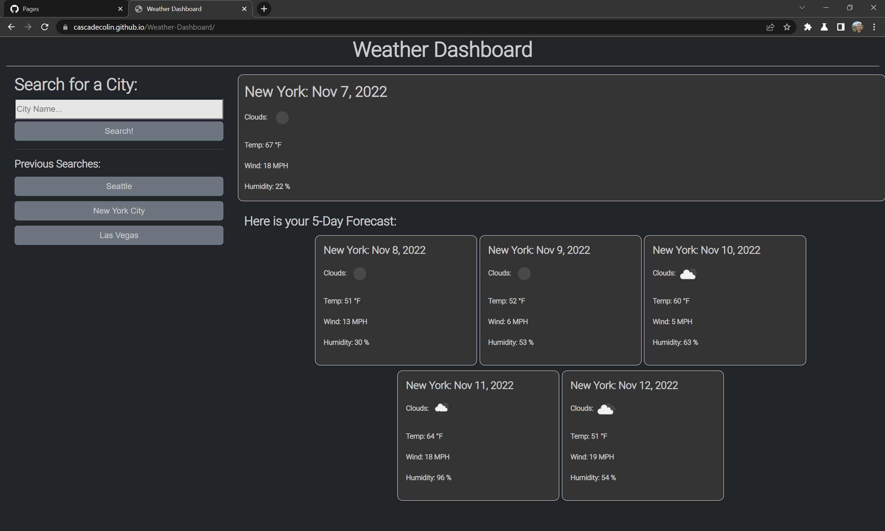

# 06 Server Side APIs: Weather Dashboard

## Overview

### The goal of this project

- Create a web application that allows users to know the weather for a specified city
- Display the current weather near the top of the page
- Display the 5 day forecast below the current weather
- Allow users to repeat a previous search with by creating a new button for each unique city

## Table of Contents

- [Description](#Description)
- [Technology](#Technology)
- [License](#license)
- [Badges](#badges)

## Description

The deployed web application can be found at: https://cascadecolin.github.io/Weather-Dashboard/

This application allows users to search the current weather and 5 day forecast for any city that can be accessed by Open Weather Map.  I heavily relied upon APIs in the creation of this web app.  The fonts are from Google Fonts, responsiveness was achieved using Bootstrap, dates are displayed using Moment, and the weather data is from Open Weather Map.

I ran into some challenges with formatting the data I was getting from Open Weather Map.  In particular, it took me a while to implement the icon images for the "Clouds:" tag.  However, getting through that has made me much more confident in reading JSON formatted data and I believe I can tackle any challenge going forward.

Overall, this was by far the most fun I've had doing a challenge.  This is the first deployed page that I feel is good enough to showcase with friends and family.  

See Below:  Deployed page displaying results for New York City, after searching Seattle and Las Vegas.

## Technology

Microsoft's VS Code was the programming platform. GitBash was used for version control for the repository. A GitHub repository was utilized for version control, as well as provide a streamlined deployment to GitHub Pages. Testing for bugs and functionality was performed using Chrome DevTools. Bootstrap CSS was utilized to provide responsiveness for mobile devices.  Moment.js was utilized to handle dates.  Fonts were provided by Google Fonts API.  Weather data is courtesy of Open Weather Map's API.

## License

MIT License

Copyright (c) 2022 CascadeColin

Permission is hereby granted, free of charge, to any person obtaining a copy
of this software and associated documentation files (the "Software"), to deal in the Software without restriction, including without limitation the rights to use, copy, modify, merge, publish, distribute, sublicense, and/or sell copies of the Software, and to permit persons to whom the Software is furnished to do so, subject to the following conditions:

The above copyright notice and this permission notice shall be included in all copies or substantial portions of the Software.

THE SOFTWARE IS PROVIDED "AS IS", WITHOUT WARRANTY OF ANY KIND, EXPRESS OR IMPLIED, INCLUDING BUT NOT LIMITED TO THE WARRANTIES OF MERCHANTABILITY, FITNESS FOR A PARTICULAR PURPOSE AND NONINFRINGEMENT. IN NO EVENT SHALL THE AUTHORS OR COPYRIGHT HOLDERS BE LIABLE FOR ANY CLAIM, DAMAGES OR OTHER LIABILITY, WHETHER IN AN ACTION OF CONTRACT, TORT OR OTHERWISE, ARISING FROM, OUT OF OR IN CONNECTION WITH THE SOFTWARE OR THE USE OR OTHER DEALINGS IN THE SOFTWARE.

## Badges

### Powered by:

